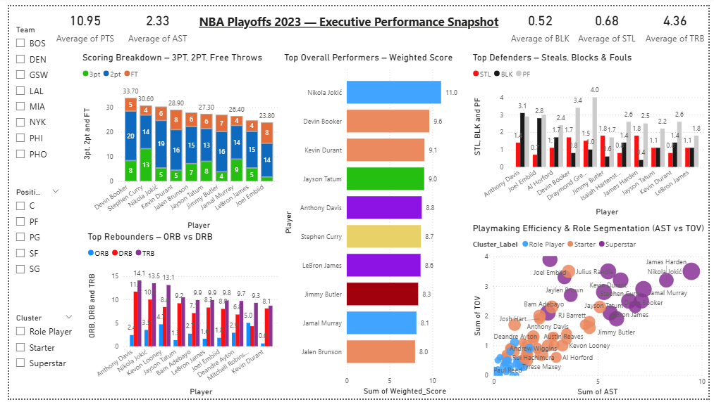

# NBA 2023 Playoff Player Performance Modeling Framework  
Multivariate Statistical Analysis • Composite Scoring • Unsupervised Learning

This project builds a structured performance evaluation framework for the 2023 NBA Playoffs using multivariate statistical modeling in R and executive reporting in Power BI.

The objective is to move beyond isolated box score metrics and engineer a normalized, composite evaluation system capable of:

- Quantifying scoring efficiency  
- Measuring playmaking effectiveness  
- Evaluating defensive contribution  
- Ranking players using weighted multi-metric scoring  
- Segmenting players using PCA and KMeans clustering  

The result is a modeling-driven performance segmentation system demonstrating applied statistical analysis, feature engineering, and unsupervised learning.

## Table of Contents
- [Scoring Trends & Efficiency](#-scoring-trends--efficiency)
- [Assist Efficiency & Playmaking](#-assist-efficiency--playmaking)
- [Defensive Standouts](#️-defensive-standouts)
- [Rebounding Leaders](#-rebounding-leaders)
- [Correlation Analysis](#-correlation-analysis)
- [Weighted Score Rankings](#-weighted-score-rankings)
- [Top 10 Overall Performers](#-top-10-overall-performers-detailed-breakdown)
- [PCA & Clustering](#-pca--clustering-unsupervised-learning)
- [Power BI Dashboard](#-power-bi-dashboard)
- [Tools & Technologies Used](#-tools--technologies-used)
- [Skills Demonstrated](#-skills-demonstrated)
- [Visual Gallery](#-visual-gallery)
- [Conclusion](#conclusion)

Power BI is used as an executive synthesis layer, while detailed modeling and exploration are performed in R.

---

## 🏀 Scoring Trends & Efficiency
- **Devin Booker** led with **33.7 PPG**, driven by elite 2PT shooting.
- **Stephen Curry** averaged **30.5 PPG**, powered by 4.4 made 3s/game.
- **Jokić** and **Durant** dominated with highly efficient, balanced scoring.

> 🔍 **Insight:** Scoring efficiency came from maximizing different strengths — FT drawing (Durant), 3PT accuracy (Curry), and interior control (Jokić).

---

## 🎯 Assist Efficiency & Playmaking
- **Jokić**: 9.5 AST, 3.5 TOV — exceptional for a center.
- **Booker** & **Harden**: High assists, low turnovers.

> 🔍 **Insight:** Top playmakers not only passed well, but protected possessions.

---

## 🛡️ Defensive Standouts
- **Steals:** Butler, Harden (1.8 STL); Booker (1.7).
- **Blocks:** Davis (3.1), Embiid (2.8).
- **Davis** was the only top-10 player in **both steals and blocks**.

> 🔍 **Insight:** Defensive anchors showed versatility without excessive fouling.

---

## 🏀 Rebounding Leaders
- **Davis**: 14.1 RPG (11.7 DRB)
- **Jokić**: 13.5 RPG
- **Looney** & **Robinson**: Offensive rebounding specialists
  
>🔍 Insight: Dominant rebounders like Davis and Jokić controlled the defensive glass, while specialists like Looney and Robinson created extra possessions through offensive rebounding.

---

## 📈 Correlation Analysis
- **PTS & AST**: 0.81  
- **PTS & DRB**: 0.71  
- **AST & STL**: 0.74  
- **DRB & BLK**: 0.65  

> 🔍 **Insight:** Great scorers were often great facilitators and rebounders, showing all-around impact.

---

## 🏆 Weighted Score Rankings

Composite Performance Score (Equal Weight Model)

Standardized metrics:
PTS, AST, STL, BLK, TRB

Each metric normalized and weighted equally (20%) to produce an aggregate performance index.

Top performers included:
1. **Nikola Jokić**
2. **Devin Booker**
3. **Kevin Durant**
4. **Jayson Tatum**
5. **Anthony Davis**

> 🔍 **Insight:** Weighted metrics reveal balanced contributors beyond box score leaders.

---

## 📋 Top 10 Overall Performers (Detailed Breakdown)

| Rank | Player         | Key Stats |
|------|----------------|-----------|
| 1️⃣ | Jokić           | 30 PPG, 13.5 REB, 9.5 AST |
| 2️⃣ | Booker          | 33.7 PPG, 7.2 AST, 1.7 STL |
| 3️⃣ | Durant          | 29 PPG, 8.7 REB, 5.5 AST |
| 4️⃣ | Tatum           | 27.2 PPG, 10.5 REB, 5.3 AST |
| 5️⃣ | Davis           | 14.1 REB, 3.1 BLK, 22.6 PPG |
| 6️⃣ | Curry           | 30.5 PPG, 6.1 AST |
| 7️⃣ | LeBron James    | 24.5 PPG, 9.9 REB, 6.5 AST |
| 8️⃣ | Jimmy Butler    | 26.9 PPG, 1.8 STL |
| 9️⃣ | Jamal Murray    | 26.1 PPG, 7.1 AST |
| 🔟 | Jalen Brunson   | 27.8 PPG, 5.6 AST |

> 🔍 **Insight:** The top 10 performers were not just high scorers — most contributed across multiple categories, reinforcing the value of all-around impact over isolated stats.

---

## 🧩 PCA & Clustering (Unsupervised Learning)

Principal Component Analysis (PCA) was applied to reduce dimensionality across 9 performance metrics, retaining 63% of total variance in the first two components.

KMeans clustering (K=3, elbow method validated) segmented players into distinct performance tiers:
  - 🟣 Superstars  
  - 🔴 Starters  
  - 🔵 Role Players

> 🔍 **Insight:** Data-driven clustering aligns with perceived roles and highlights undervalued contributors.

---

## 📊 Power BI Dashboard

An interactive Power BI dashboard provides executive-level synthesis of model outputs, enabling dynamic filtering by player, team, and cluster assignment.

- Top Performers (Weighted Score)
- Scoring Breakdown (2PT / 3PT / FT)
- AST vs TOV (Bubble = Weighted Score)
- Offensive & Defensive Rebounding
- Defensive Efficiency (STL, BLK, PF)

📁 Files:
- [`NBA_2023_Playoff_Analysis (1-).pbix`](NBA_2023_Playoff_Analysis%20(1-).pbix)
- 

---

## 🧰 Tools & Technologies Used
- **R / RStudio** – Data wrangling, modeling, and clustering
- **Power BI** – Interactive dashboard and stakeholder visuals
- **ggplot2**, **ggcorrplot**, **factoextra** – Correlation, PCA, and cluster visualization
- **tidyverse**, **dplyr**, **scales**, **readxl** – Data prep and formatting
- **KMeans / PCA** – Unsupervised learning methods
- **DAX (Power BI)** – Custom measures for scoring, filtering, and KPI logic

---

## 💼 Skills Demonstrated

- Advanced Exploratory Data Analysis (EDA)
- Multivariate Statistical Analysis
- Feature Engineering & Metric Normalization
- Composite Score Modeling
- PCA Dimensionality Reduction
- K-Means Clustering & Segmentation
- Correlation & Performance Dependency Analysis
- Interactive BI Dashboard Development (Power BI)
- Cross-Tool Analytical Workflow (R → Power BI)

---

## 📸 Visual Gallery

#### 🔹 Correlation Heatmap

#### 🔹 Shooting Breakdown of Top Scorers

#### 🔹 Assist Leaders (AST vs TOV)

#### 🔹 Steals Leaders (STL vs PF)

#### 🔹 Block Leaders (BLK vs PF)

#### 🔹 Rebound Leaders (ORB vs DRB)

#### 🔹 Top 10 Overall Players Breakdown

#### 🔹 Elbow Method for Optimal Clusters

#### 🔹 PCA Clustering of Player Roles

---

## Conclusion

This project demonstrates applied multivariate analysis, composite metric engineering, dimensionality reduction, and unsupervised clustering within a structured analytical workflow.

By integrating R-based modeling with Power BI executive reporting, the framework delivers:

- Statistically grounded player rankings  
- Multi-dimensional performance segmentation  
- Reproducible composite scoring methodology  
- Cross-platform analytical integration  

The project reflects advanced analytical capability aligned with data analytics, machine learning, and business intelligence disciplines.
