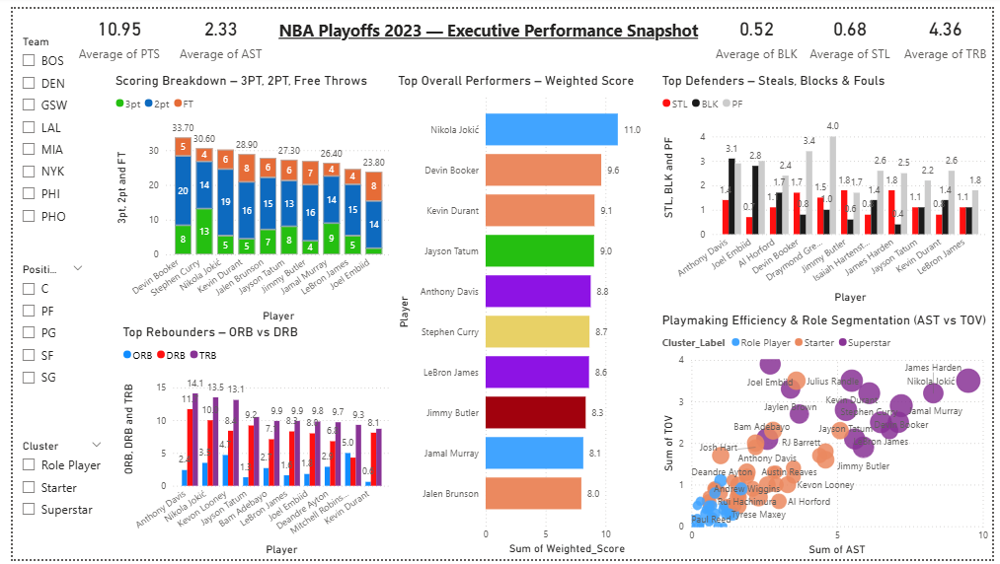

# NBA 2023 Playoff Player Performance Modeling Framework  
Multivariate Statistical Analysis • Composite Metric Engineering • Unsupervised Learning

This project develops a multi-metric performance modeling framework using standardized feature engineering and unsupervised learning to evaluate high-dimensional player performance data from the 2023 NBA Playoffs.

Rather than relying on isolated box score statistics, the framework engineers normalized performance metrics and aggregates them into a composite index capable of:

- Quantifying scoring efficiency across usage profiles  
- Measuring playmaking effectiveness relative to turnovers  
- Evaluating defensive contribution across multiple dimensions  
- Ranking players using weighted, standardized multi-metric scoring  
- Segmenting players into performance tiers using PCA and KMeans clustering  

R is used for statistical modeling and dimensionality reduction, while Power BI serves as an executive reporting layer for interactive synthesis of model outputs.

The result is a structured analytical system demonstrating feature engineering, multivariate modeling, dimensionality reduction, and reproducible segmentation logic.

## Table of Contents
- [Exploratory Feature Analysis](#exploratory-feature-analysis)
- [Correlation Analysis](#correlation-analysis)
- [Core Modeling Framework](#core-modeling-framework--composite-performance-index)
- [Dimensionality Reduction & Segmentation](#dimensionality-reduction--unsupervised-segmentation)
- [Power BI Dashboard](#power-bi-dashboard)
- [Tools & Technologies Used](#tools--technologies-used)
- [Skills Demonstrated](#skills-demonstrated)
- [Visual Gallery](#visual-gallery)
- [Conclusion](#conclusion)
  
Power BI is used as an executive synthesis layer, while detailed modeling and exploration are performed in R.

---

## Exploratory Feature Analysis

Initial exploratory analysis evaluated core performance dimensions across scoring, playmaking, defense, and rebounding.

Key observations:

- High-volume scorers often demonstrated strong assist correlation, reinforcing multi-dimensional offensive impact.
- Elite rebounders (e.g., Davis, Jokić) controlled defensive possessions while maintaining scoring efficiency.
- Defensive contributors showed measurable versatility through combined steal and block metrics.
- Assist-to-turnover efficiency differentiated high-usage creators from volume passers.

These findings informed the selection of standardized metrics used in composite scoring and clustering.
---

##  Correlation Analysis
- **PTS & AST**: 0.81  
- **PTS & DRB**: 0.71  
- **AST & STL**: 0.74  
- **DRB & BLK**: 0.65  

> **Insight:** Strong positive correlations between scoring, assists, and rebounding indicate that high-impact players contributed across multiple dimensions rather than specializing in isolated metrics.

---

## Core Modeling Framework — Composite Performance Index

To quantify overall player impact, a standardized composite performance index was engineered using equal-weight normalization across five primary metrics:

- Points (PTS)  
- Assists (AST)  
- Total Rebounds (TRB)  
- Steals (STL)  
- Blocks (BLK)  

Each metric was z-score normalized to eliminate scale distortion and weighted equally (20%) to construct an aggregate performance score.

This composite framework enables:

- Cross-position comparison  
- Balanced multi-dimensional ranking  
- Removal of single-metric bias  
- Transparent and reproducible scoring methodology  

Top-ranked performers under this framework included:

1. Nikola Jokić  
2. Devin Booker  
3. Kevin Durant  
4. Jayson Tatum  
5. Anthony Davis  

The composite index highlights players with balanced multi-category contributions rather than isolated statistical dominance.
---

##  Top 10 Overall Performers (Detailed Breakdown)

| Rank | Player         | Key Stats |
|------|----------------|-----------|
| 1️⃣ | Jokić           | 30 PPG, 13.5 REB, 9.5 AST |
| 2️⃣ | Booker          | 33.7 PPG, 7.2 AST, 1.7 STL |
| 3️⃣ | Durant          | 29 PPG, 8.7 REB, 5.5 AST |
| 4️⃣ | Tatum           | 27.2 PPG, 10.5 REB, 5.3 AST |
| 5️⃣ | Davis           | 14.1 REB, 3.1 BLK, 22.6 PPG |
| 6️⃣ | Curry           | 30.5 PPG, 6.1 AST |
| 7️⃣ | LeBron James    | 24.5 PPG, 9.9 REB, 6.5 AST |
| 8️⃣ | Jimmy Butler    | 26.9 PPG, 1.8 STL |
| 9️⃣ | Jamal Murray    | 26.1 PPG, 7.1 AST |
| 🔟 | Jalen Brunson   | 27.8 PPG, 5.6 AST |

>  **Insight:** The top 10 performers were not just high scorers — most contributed across multiple categories, reinforcing the value of all-around impact over isolated stats.

---

## Dimensionality Reduction & Unsupervised Segmentation

Principal Component Analysis (PCA) was applied across nine standardized performance metrics to reduce dimensional complexity while preserving variance structure.  

The first two principal components retained 63% of total variance, enabling interpretable two-dimensional visualization of player performance space.

KMeans clustering (K=3, validated using the elbow method) segmented players into three statistically distinct performance tiers:

- Superstars  
- Core Starters  
- Role Players  

This unsupervised framework demonstrates the ability to derive interpretable player archetypes without manual labeling, reinforcing reproducible, data-driven segmentation logic.
---

##  Power BI Dashboard

An interactive Power BI dashboard provides executive-level synthesis of model outputs, enabling dynamic filtering by player, team, and cluster assignment.

- Top Performers (Weighted Score)
- Scoring Breakdown (2PT / 3PT / FT)
- AST vs TOV (Bubble = Weighted Score)
- Offensive & Defensive Rebounding
- Defensive Efficiency (STL, BLK, PF)

 Files:
- [`NBA_2023_Playoff_Analysis (1-).pbix`](NBA_2023_Playoff_Analysis%20(1-).pbix)
- 

---

##  Tools & Technologies Used
- **R / RStudio** – Data wrangling, modeling, and clustering
- **Power BI** – Interactive dashboard and stakeholder visuals
- **ggplot2**, **ggcorrplot**, **factoextra** – Correlation, PCA, and cluster visualization
- **tidyverse**, **dplyr**, **scales**, **readxl** – Data prep and formatting
- **KMeans / PCA** – Unsupervised learning methods
- **DAX (Power BI)** – Custom measures for scoring, filtering, and KPI logic

---

##  Skills Demonstrated

- Advanced Exploratory Data Analysis (EDA)
- Multivariate Statistical Analysis
- Feature Engineering & Metric Normalization
- Composite Score Modeling
- PCA Dimensionality Reduction
- K-Means Clustering & Segmentation
- Correlation & Performance Dependency Analysis
- Interactive BI Dashboard Development (Power BI)
- Cross-Tool Analytical Workflow (R → Power BI)

---

##  Visual Gallery

#### 🔹 Correlation Heatmap

#### 🔹 Shooting Breakdown of Top Scorers

#### 🔹 Assist Leaders (AST vs TOV)

#### 🔹 Steals Leaders (STL vs PF)

#### 🔹 Block Leaders (BLK vs PF)

#### 🔹 Rebound Leaders (ORB vs DRB)

#### 🔹 Top 10 Overall Players Breakdown

#### 🔹 Elbow Method for Optimal Clusters

#### 🔹 PCA Clustering of Player Roles

---

## Conclusion

This project demonstrates the ability to engineer composite metrics, normalize multi-dimensional performance data, and apply unsupervised learning techniques to derive interpretable performance segments.

By integrating R-based statistical modeling with Power BI executive reporting, the framework delivers:

- Reproducible composite performance scoring  
- Multi-dimensional player evaluation  
- PCA-based dimensional reduction  
- Data-driven clustering of performance tiers  
- Cross-platform analytical integration  

The modeling approach reflects applied multivariate analysis aligned with data analytics, statistical modeling, and machine learning workflows.
